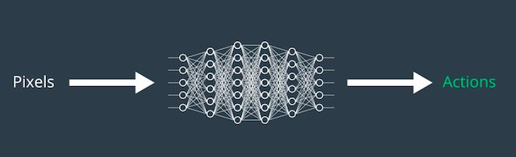
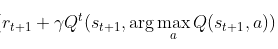
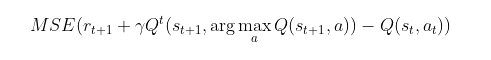
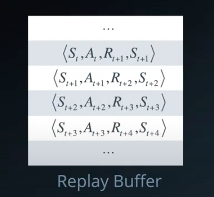
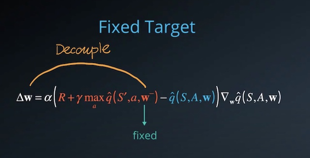

# Project Report

## Overview

The agent was trained to collect yellow bananas(earns a reward of +1) while trying to avoid blue bananas(earns a reward of -1). It learns from its interaction with the environment and seeks to maximize the expected cumulative reward by estimating the optimal action-value function at each state to discover an optimal policy and follow it. This task can be achieved by using either Monte Carlo Prediction Methods or Temporal-Difference Methods such as Q-Learning. In Q-Learning, the action-value function can be expanded to a function of the discount factor gamma and future rewards:


For this task, I have implemented a Vanilla Deep Q-Network, an algorithm that combines TD Methods and neural networks in Deep Learning, to train the agent to collect bananas. 

## Learning Algorithm

The Deep Q-Network was movivated by the idea that we can make use of the powerful neural networks(NN) and employ them as non-linear function approximators. Observations from the environments are passed into the NN, and a single output for each valid action is outputted. In this task, DQN takes in a discrete state space of size 37 as input, it can, however, be modified to take in raw pixels as input. 



#### Function Approximation and Optimization
Though it was possible to represent action-value function on a discrete state space using the Q-table, the state space could be continuous in real life and a Q-table would not be suffice. Hence, there was a need to generalize and apply RL techniques on a continuous scale of state space. Function approximation was then introduced to represent state values and action values by combination of their features and weights. Utilizing Gradient Descent for linear function approximation or Neural Networks for non-linear function approximation, one can nudge the weights and minimize the difference between the true value function and the approximated value function (basically a numerical optimization problem at this point). In DQN, the target value can be calculated by the equation:



This task would then be to minimize the TD error, which is the difference between the TD target and the current estimate value. 



#### Experienced Replay
However, RL is proven by the original author of the DQN paper to be unstable and will even diverge when using a non-linear function approximator, such as an NN, to represent the action-value function. Solutions such as the biologically-inspired technique called 'experienced replay' and 'fixed Q-target' were proposed to fix this issue. In this task, I have implemented experienced replay, in which I store tuples of previous state-action pairs in a replay buffer(of size 100,000) and samples these previous information(in a batch of size 64) randomly throughout the process of learning to help the agent learns from past experience. This helps prevent the oscillation and divergence of action values, since the naive DQN often become biased by the correlations between sequential experience tuples. The implementation of `experienced replay` can be found in the `agent.py` file.



#### Fixed Q-Target
In addition to experienced replay, I implemented a soft update process in my code as well. The motivation behind this is the problem of moving target, resulting a TD error that is not likely to change much as the agent learns, since both the TD target and the current value depends on the weights. A solution to this is to hold the weights of the TD target constant and update the current value first. Only after 4 episodes the TD target will then be allowed to update. The implementation of `fixed Q-target` can be found in the `agent.py` file.



#### Epsilon-Greedy Policy
I have also implemented the epsilon-greedy policy for this task as I tackle the exploration-exploitation dilemma. I tends to let the agent explores and tries out different paths in the beginning. As time goes on, it should learn from its interaction with the environment and begin to trust its experience to decide the optimal path. Therefore, I have set the starting value to be 1.0 such that the agent follows an equiprobable random policy at first. I have then set the decay rate for epsilon to be 0.995 and the final value for epsilon after decaying to be 0.01 so that epsilon will decay gradually over time.


## Choice of Hyperparameters

The network architecture is consisted of: 2 hidden layers, each having 64 hidden units; 1 output layer with a single output for each valid action. The network structure can be found in the `model.py` file.

Following hyper parameters where used:
``` python
num_episode = 2000      # number of episodes ran
eps_start=1.0           # the starting value for epsilon
eps_end=0.01            # the final value for epsilon after decaying
eps_decay=0.995         # the epsilon decay rate
LR = 5e-4               # learning rate
BUFFER_SIZE = 100000    # replay memory size
BATCH_SIZE = 64         # minibatch size
GAMMA = 0.99            # discount factor
TAU = 1e-3              # for soft update of target parameters
UPDATE_EVERY = 4        # how often should the network be updated.
```

## Plot of Rewards
#### Baseline
Prior to training, the baseline of the agent's performance was initiated with the code provided below. The agent takes random actions and has no knowledge about the environment since it has not experienced any interactions with the environment yet.
``` python
env_info = env.reset(train_mode=False)[brain_name] # reset the environment
state = env_info.vector_observations[0]            # get the current state
score = 0                                          # initialize the score
while True:
    action = np.random.randint(action_size)        # select an action
    env_info = env.step(action)[brain_name]        # send the action to the environment
    next_state = env_info.vector_observations[0]   # get the next state
    reward = env_info.rewards[0]                   # get the reward
    done = env_info.local_done[0]                  # see if episode has finished
    score += reward                                # update the score
    state = next_state                             # roll over the state to next time step
    if done:                                       # exit loop if episode finished
        break

print("Score: {}".format(score))
```
This results in a performance score of 0. However, our goal is to improve the agent's performance and trains it until it can reach an average score of at least 13.0 over 100 consecutive episodes.

#### After Training 
Though I trained the agent for 2000 episodes, the environment was solved at around 500 episodes. The average score peaks at around 900 episodes, reaching 16.58.  

[image1]: PlotOfRewards.png "rewards"
![Rewards][image1]


## Ideas for Future Work

For this project, I have only implemented the base model with the basic environment provided by Unity. Though it was able to solve the tasks, I would like to go far and beyond to experiment further with this project. 

- I plan to feed the network with pixel values as input rather than the 37 states provided. I will then add a few convolutional layers to my Vanilla DQN, train the agent and evaluate its performance.
- I plan to implement more advanced models such as the Dueling DQN and the Rainbow DQN and compare the performance between my Vanilla DQN with that of the more advanced models.
- I plan to make adjustments to the environment such as deploying more blue bananas while reducing the number of yellow bananas in the environment to make the task harder for my agent. I will then evaluate the performance of my agent at various difficulties using different models to compare its performance.


```python

```
